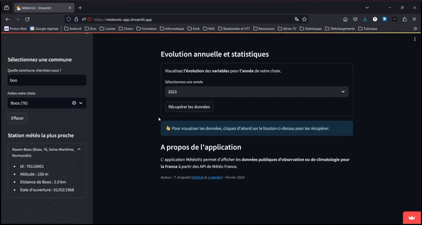

## MétéoViz

:fr:

Depuis le 1er janvier 2024 toutes les données publiques de Météo-France disposent d'une possibilité d'accès par API sans aucun frais et sont gratuitement réutilisables.

MétéoViz est une application développée avec le *framework* Streamlit permettant de visualiser les **données publiques d'observation ou de climatologie pour la France** à partir des API de Météo-France.

Pour une station d'observation spécifique, il possible de :
1. visualiser en temps réel les observations les plus récentes ;
1. visualiser les données d'observation à une date et une heure antérieures ;
1. visualiser et afficher les statistiques des données d'observation pour une année complète.

:uk:

Since 1 January 2024, all Météo-France public data can be accessed via API at no cost and can be reused free of charge.

MétéoViz is an application developed with the Streamlit *framework* that lets you view **public observation or climatological data for France** using Météo-France APIs.

For a specific observation station, it is possible to :
1. view the most recent observations in real time ;
1. view observation data for a previous date and time;
1. view and display observation data statistics for a full year.

## Observations en temps réel / *Real time observations*

## Observations à une autre date et heure / *Other date and time observations*

## Observations sur une année complète / *Observations for an entire year*

